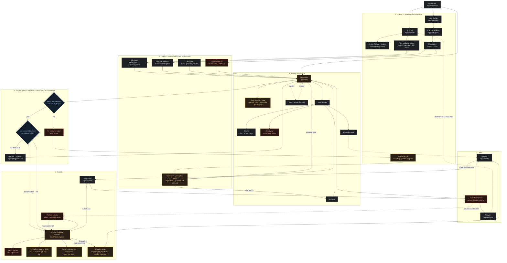

# Library → Publish — user journey and implementation plan

Written 2026-09-13, against `design-mockups/library-v3.dc.html`.

Companion documents: [`PLATFORM-PUBLISH-FIELDS.md`](PLATFORM-PUBLISH-FIELDS.md) (what each destination accepts), and the packet reviews under `docs/calendar-library-rebuild/packet-2-personal-library/`.

---

## 0. The headline, before the diagram

**Most of this is wiring, not building.** Going in, the assumption was that a publish composer, a schedule picker and a discovery score would all be new. None of them are:

| Assumed new | Actually exists | Where |
|---|---|---|
| Publish composer | `QuickPostComposer.jsx` | `src/calendar/components/` |
| Schedule picker | `ScheduleModal.jsx` | `src/calendar/components/` |
| SEO / discovery score | `seo-score` + `optimize-seo` edge functions, already platform-aware | `supabase/functions/` |
| Upload with dedupe | `UploadModal.jsx` + checksum + perceptual hash | `src/pages/Library/components/`, `assetLibraryService.js` |
| Trash / restore | `TrashView.jsx` + soft-delete methods | `src/pages/Library/` |
| Asset drawer | `AssetDetailDrawer.jsx` | `src/pages/Library/components/` |
| AI disclosure to YouTube | `status.containsSyntheticMedia` | `_shared/youtube.service.ts:276` |

Genuinely new: the **two publishability gates**, the **platform preview**, the **published receipt**, and the **Instagram/Facebook adapters**. Everything else is connecting things that already work to a surface that never called them.

This matters for sequencing. The cheap, high-value work is front-loaded, and the one genuinely large item (Meta adapters) is isolated at the end where it can slip without blocking anything.

---

## 1. User journey — existing screens, new screens, and the joins

**Reading the colours:** grey = exists and is reused unchanged · amber = exists and is extended · orange = genuinely new · blue = the new decision logic.

**The three joins that don't exist today, and are the whole point:**

1. **Library → Composer.** Today Library's Schedule button navigates to Calendar with a URL parameter, and a Publish button does not exist at all. The composer never opens from Library.
2. **Composer → `seo-score`.** The function exists, is platform-aware, and is called from Studio and Calendar — never from a publish flow.
3. **Send → Receipt.** There is no post-publish destination. The publish happens and the user is left where they were, with a toast.

---

## 2. What we would actually be working on

### 2.1 The two gates (the core)

Everything else is presentation; this is the part that prevents a real defect. On 2026-09-11 a YouTube post failed fourteen seconds after creation with "This post has no media attached", because an uploaded asset carried no `generation_id` and the publisher resolves media only through `posts → generations`.

- **Gate 1 — resolvable media.** Derive per asset: is there a media reference the publisher can follow? Surface as a card state (`Ready` / `No file`), disable Publish, offer a repair path.
- **Gate 2 — destination fit.** Cross `personal_assets.media_type` against `publish_providers` and the user's connected accounts. Surface as per-platform fit chips and a "no destination" state that offers *Connect* rather than a dead end.

Both are **derived, not stored** — no new columns. That matters: a stored flag goes stale silently, which is this codebase's signature failure.

### 2.2 Library surface

Replace the status rails with provenance rails (`upload` / `clip` / `generation` / `post`) plus `never used` / `archived` / `trash`. Add **clip** as a distinguishable source — today `saveClipToLibrary` writes `source='upload'`, so the product's most distinctive capability is invisible in its own library.

### 2.3 Composer

Extend `QuickPostComposer` rather than fork it: media preview at true aspect ratio, per-destination caption overrides with real character limits, per-platform required fields, locked destinations shown with reasons, and the discovery score.

### 2.4 Platform preview

New, and the one piece with a maintenance cost worth naming: platform chrome changes. **Keep the chrome generic and the truncation exact** — the value is showing where the caption is cut, not imitating anyone's app. A preview that is subtly wrong about layout is tolerable; one that is wrong about the fold is worse than none.

### 2.5 Receipt

New screen, reached after publish, reporting **per destination** because a multi-destination publish can half-succeed — and stating platform restrictions plainly (YouTube forced-private, TikTok `SELF_ONLY`) instead of an unqualified success.

### 2.6 Instagram + Facebook adapters

The only genuinely large item. Credentials exist; no publishing path does. Instagram is two-step (create container → publish) and JPEG-only for images; Facebook has different endpoints per media type and is the only platform with native API-side scheduling. See `PLATFORM-PUBLISH-FIELDS.md` §4–5.

---

## 3. Sequencing

Ordered so each phase ships something usable, and nothing later is blocked by something earlier slipping.

### Phase 0 — Make every screen match before adding to any of them
*Measured 2026-09-13, not asserted. See §6 for the commands and their output.*

The personal workspace is largely on design-system v2 already: `check:ui-v2-isolation` passes, `check:app-shell` confirms one nav, one theme toggle and every personal route on `AppShell`, and `check:token-contrast` clears WCAG AA on all 26 token/background pairs in both themes. Three real gaps remain, and they are cheap:

- **Video Clips is the least-migrated screen.** 14 of its 17 components don't import `src/ui-v2`, and `videoEngine.css` carries 8 raw-colour findings — the joint-worst file in the repo. It is one of the five nav destinations and the source of the product's most distinctive capability. Migrate it to `ui-v2` primitives and tokens.
- **Calendar carries the other 8 raw-colour findings** (`calendar-engine-v2.css`) plus the only three accessibility failures in the app: `` without `alt` in `CalendarGrid.jsx:254`, `CalendarListView.jsx:211`, `UnscheduledRail.jsx:73`. The Library already generates alt text per asset — these three are a wiring fix, not an authoring job.
- ~~**Seven legacy stylesheets are imported by nothing.**~~ **WRONG — corrected 2026-09-13.** All seven are loaded, via `@import` in `src/styles/app-entry.css`, which `app/layout.jsx` imports on every page. The original check looked only for JS imports and missed the CSS import chain. They are also still *used*: `GeneratePromptBar.css` has 32 of its first 40 classes referenced in live JSX, `GenerateV2.css` 12, `responsive-contract.css` 9. Retiring them is a class-by-class migration, not a delete. **Left in place.**

- **The real dead code was elsewhere, and it was much larger.** A transitive import graph from all 106 Next.js entry points found **20 unreachable modules** across the two video trees — `src/components/video-engine/` (16 of 20 files) and `src/pages/VideoEngine/` (4 page components with no importers). Deleted 2026-09-13. Among them `VideoPlayer.jsx`, the single worst raw-colour file in the repo at 21 findings, reachable by nobody.

- **A guard was protecting a dead file.** `check-video-prefs-contract.cjs` verified that `SubmitForm.jsx` sends six preference fields to the video worker. `SubmitForm.jsx` was unreachable; the live submit UI is `NewJobSheet.jsx`. The check passed while proving nothing about the path users take. Repointed at the live form — which was already sending all six, so no user-facing defect, but the guard had been giving false assurance. **This is the more valuable finding than the deletion**: a stale guard is worse than no guard, because it stops anyone looking.

**One decision sits underneath all three.** There are two live token vocabularies: `--uiv2-*` (78 files) and `--color-*` (70 files). They are not cleanly separated — `src/pages/Settings.module.css:22` aliases `--color-bg-page: var(--uiv2-bg-canvas)`, while `src/styles/tokens.css:125` defines the same name as a literal `#FAFAF7`. So the *same token name resolves to different colours depending on which file is in scope*. That ambiguity, not any single wrong colour, is the consistency risk. Either finish the alias bridge everywhere or complete the migration — but stop leaving both true.

**Proven:** `npm run check:ui-consistency` drops to zero raw-colour findings in `videoEngine.css` and `calendar-engine-v2.css`, and zero missing-alt findings.
**Guarded:** a per-path ratchet, `UI_CONSISTENCY_STRICT_PATHS=a,b`, added 2026-09-13. Flipping the whole repo strict would mean clearing 180+ findings before anything else could merge, so nobody would do it and the check would stay advisory forever. Instead, cleaned paths are enforced individually and the enforced set grows; a listed path can never regress.

### Phase 0 — COMPLETE, 2026-09-13

Seven commits on `feat/direct-social-publishing`. Final state: **every enforceable bucket in `check:ui-consistency` is zero** — no raw colours, no generic global selectors, no missing alt, no unlabelled icon buttons, no `transition: all` — and CI enforces `UI_CONSISTENCY_STRICT_PATHS=src`, the whole tree. It began the day reporting 254 findings and exiting zero. 19 guard scripts pass; `next build` exits 0.

Two real defects were found and fixed along the way, neither of which was the work being looked for:

1. **The TikTok and YouTube publishing panels rendered dark surfaces in light theme.** Six `--uiv2-*` tokens were referenced and defined nowhere, each with a hardcoded dark fallback. A custom property with a fallback never errors — it silently does the wrong thing. Now guarded by `check:uiv2-tokens`.
2. **A guard was aimed at dead code.** `check-video-prefs-contract` verified a form no route could reach, passing on every run while proving nothing. Repointed at the live form.

**Detail:**

| Change | Effect |
|---|---|
| Fixed the `` regex in `check-ui-consistency` | The 3 "missing alt" failures were the literal string `` **inside code comments**. Every real `` already had alt, inside a `<button>` carrying the post title — `alt=""` was correct. 3 → 0, no app change. |
| Allowlisted `src/ui-v2/tokens.css` as a token source | The old `src/styles/tokens.css` was allowlisted; the canonical v2 file never was, so the design system reported 62 findings against itself. 245 → 183 raw colours, no app change. |
| Added the per-path ratchet | `UI_CONSISTENCY_STRICT_PATHS` enforces named paths while the rest still reports. Verified: exit 1 on dirty paths, 0 when clean. |
| Deleted 20 unreachable video modules | Confirmed by transitive graph from 106 entry points, not by grep. All were git-tracked before removal. |
| Repointed `check-video-prefs-contract` | From the unreachable `SubmitForm.jsx` to the live `NewJobSheet.jsx`. |
| Fixed 6 undefined `--uiv2-*` tokens | TikTok/YouTube publishing panels and StudioPage painted fixed dark colours that never followed the theme. New guard `check:uiv2-tokens` prevents recurrence. |
| Cleared Studio, Legal, VideoEngine, ConnectAccount | Real drift migrated to tokens; local palettes promoted to named tokens; intentional cases marked with an inline reason. |
| Promoted Landing's palette | 27 new `--lp-*` tokens for the dark bands and state washes that were never tokenised — `#FFF` alone had been retyped nine times. |
| Ratchet reached the whole tree | `UI_CONSISTENCY_STRICT_PATHS=src` in CI. 254 findings → 0 enforceable. |

Total findings 254 → 189 **before** the deletion, entirely by removing false positives — that is, a third of what the check reported was noise, which is precisely why it was never made strict.

### Phase 1 — The gates and an honest grid
*Highest value per unit of work in the plan: it closes a defect class that has already shipped.*

- Derive publishability and destination fit; render as card state + fit chips.
- Provenance rails; clip as a first-class source with source-video and timecode.
- Repair path for assets with no resolvable media.

**Proven:** unit tests over the derivation for every combination of `media_type` × connected-provider set, including the empty set.
**Guarded:** a CI check asserting no asset can render a Publish affordance while failing Gate 1 — the detector the original defect lacked.

### Phase 2 — Composer

> **Finding, 2026-09-14 — there is no "publish now" path in this product.**
>
> `publish-post` has exactly one caller: the database cron worker
> `process-scheduled-posts`, registered `* * * * *`, which selects
> `status = 'scheduled' AND scheduled_at <= now()`, marks each row publishing to
> prevent duplicate dispatch, and caps at 50 per run. Nothing client-side can
> invoke the publisher. Every post that has ever gone out did so because a row
> sat in `posts` with a past `scheduled_at`.
>
> The `library-v3` mockup's **Publish now** button and the published-receipt
> screen both assume an on-demand path that does not exist.
>
> **Resolution: "Publish now" writes `scheduled_at = now()`.** The worker picks
> it up inside a minute, through the dispatcher that is already proven in
> production — no new endpoint, no second auth surface, no idempotency problem
> to re-solve. `QuickPostComposer.onSubmit` gains a third mode alongside
> `draft` and `schedule`.
>
> **What this changes in the UI, and it is not cosmetic:** the button may not
> claim "Published". It claims *going out now*, and the receipt reports queued,
> then confirmed when the post's status actually moves. Asserting success at
> click time is precisely what failed on 2026-09-11, when a post reported
> success and died fourteen seconds later.

- Open `QuickPostComposer` from Library with the asset and its generation attached.
- Media preview; per-destination captions with real limits; per-platform required fields; locked destinations with reasons.

**Proven:** an E2E run per platform asserting the request body matches `PLATFORM-PUBLISH-FIELDS.md` — in particular that YouTube receives a title and TikTok receives `SELF_ONLY`, and that neither is silently defaulted.
**Guarded:** a contract test that fails if a required field is dropped between composer and adapter.

### Phase 2 — COMPLETE, 2026-09-15

**The finding that reframed the phase: every TikTok post the composer created was already failing at publish.** Not hypothetically — traced end to end. `QuickPostComposer` offers every platform with a live credential (`QuickPostComposer.jsx:74-93`, reading `connected_accounts_health_summary`), TikTok included. `createQuickPost` wrote `workflow_state` only when `platformKey === 'youtube'` (`calendarService.js:428-441`). So `optionsFor("tiktok")` returned null (`publish-post/index.ts:256-259`) and the adapter refused with *"No TikTok privacy level was chosen for this post"* (`tiktok.service.ts:195-200`) — correctly, since `privacy_level` is deliberately undefaulted there. Three components each behaving exactly as documented, and the post died between them. Phase 2 was therefore less "build a composer" than "connect one that was already half-wired".

**The second finding: the collection UI existed and was mounted nowhere users go.** `TikTokOptionsPanel` and `YouTubeOptionsPanel` both already emitted their adapter's exact key vocabulary — TikTok camelCase (`tiktok.service.ts:195,246-250`), YouTube snake_case (`youtube.service.ts:158,173-182`) — and both were mounted only in Studio's `PostProductionPanel`. The composer meanwhile hand-rolled two made-for-kids buttons and hardcoded `privacyStatus:'private'`, collecting neither `contains_synthetic_media` nor `category_id`, both of which the adapter reads. The fix was to mount the real panels, not to write better fields.

| Change | Effect |
|---|---|
| Mounted the shared `TikTokOptionsPanel` / `YouTubeOptionsPanel` in the composer | The platforms it offers are now the platforms it can satisfy. TikTok's panel is a compliance artefact whose exact controls condition Direct Post approval — a local copy would drift. |
| `workflow_state` written per platform, keyed by the row's own `platformKey` | Closes the TikTok failure above. |
| `onSubmit` gained a third mode, `publish` | `status:'scheduled'` with `scheduled_at = now()`. No second endpoint: `publish-post` still has exactly one caller. |
| Per-platform title field, gated on `platformNeedsTitle()` | YouTube no longer publishes videos named `clip-3.mp4`. Closes open decision #3. |
| AI disclosure read from `generation_defaults.ai_disclosure` | The setting had a UI and **no reader** since it shipped. One control, not two: `YouTubeOptionsPanel` takes it as a controlled prop and hides its own checkbox. |
| Caption limits sourced from `getPlatformSpec()` | Deleted a second hardcoded limit table that agreed with the first by luck and nothing else. |
| Library mounts the composer in place | `derivePublishability()` decides the affordance; it is never re-derived. |
| Confirmation copy moved to `quickPostConfirmation.js` | "Going out now", never "Published" — Calendar and Library cannot drift apart on the one claim the click cannot make. |

**Four defects found in the work itself, and the last two were found only by RENDERING it:**

1. **A temporal dead zone that `next build` compiled without complaint.** `sendBlocked` read `isSubmitting` seventeen lines before its `const` — a `ReferenceError` on the composer's first render. The build exits 0 because compiling a modal is not rendering one. Caught by checking declaration order, then confirmed by rendering. *A green build is not a rendered component.*
2. **The new guard passed while reading its own documentation.** Two assertions fired against comments in the files they guarded. The comment stripper then failed too — this repo has mixed line endings, `split('\n')` leaves a trailing `\r`, and JavaScript's `.` does not match `\r`, so `//.*$` never reached end-of-line. The same latent bug sat in `check-tiktok-ux-compliance.cjs`, a *compliance* guard; fixed and re-verified there too.

3. **An infinite render loop — "Maximum update depth exceeded".** `YouTubeOptionsPanel` emits from an effect that lists `onChange` in its dependencies. `useCallback((key) => (settings) => …)` memoises only the OUTER function, so each render still returned a fresh inner arrow: effect fires → parent `setState` → re-render → new callback → effect fires. The composer was unusable. **Only YouTube showed it** — TikTok's panel omits `onChange` from its deps — which is exactly how a defect hides in one of two otherwise identical integrations. Fixed with ref-cached per-platform handlers, now asserted by the contract guard.

4. **A temporal dead zone `next build` compiled happily.** Recorded above.

**Both 3 and 4 were invisible to every static guard and to the build.** They were found by opening the composer in a browser. The lesson is the standing one, earned again: a green build is not a rendered component.

**Two false alarms worth recording, because each looked exactly like a real defect:**

- **"The options panel renders near-black on a light page."** Measured `rgb(23,24,27)` on `rgb(250,250,247)` — the signature of the undefined-token defect. It was the *test*: `--uiv2-*` tokens are scoped to `[data-uiv2-theme]`, stamped by `UiV2ThemeProvider` from localStorage key **`uiv2-theme`** (`ThemeProvider.jsx:6`), and the spec set only the legacy `app-theme-preference`. That produced a light body with ui-v2 still dark — a state the real toggle cannot reach. Measured correctly afterwards: panel `#FFFFFF` on page `#FAFAF7` in light, `#17181B` on `#0E0F11` in dark. **Correct in both.**
- **"No asset is publishable."** Zero enabled Publish buttons — because the Library had not finished loading and every rail read `All 0`. A fixed `waitForTimeout` raced the fetch. A timing artifact that renders as a product claim is worse than a crash, because it is quotable.

**Guarded:** `scripts/check-composer-field-contract.cjs`, 27 links, in CI. It walks *panel emits → composer collects → service persists → adapter reads* and fails in **both** directions — a key an adapter demands that nothing sends, and a platform that refuses without settings the composer never collects. The refusing-platform list is derived from the adapters at runtime, not hardcoded, so the two cannot drift apart.

**Verified to fail, per the standing rule.** Eleven deliberate breaks across all six assertion groups, each producing exit 1, each restored. `check-media-required-guard` was extended the same way and **a real weakness was found by that process**: moving a send handler from a `<button>` onto an `<a>` left the guard borrowing the previous sibling button's `disabled={sendBlocked}`, and it passed. Bounded on `</button>` and re-verified.

**Proven by rendering:** `tests/e2e/library-publish-composer.spec.js`, both themes, measured rather than eyeballed — no page or React errors, composer opens without navigating, exactly one AI-disclosure control, YouTube's own synthetic-media checkbox absent (`count === 0`), a real YouTube title field, panel/page background luminance compared numerically, and "Publish now" disabled before the COPPA answer (`true`) and enabled after (`false`). It asserts the QA account has a publishable YouTube connection and **fails rather than skips** without one — a spec that quietly stops proving anything is the failure mode this repo keeps producing.

*Known limitation:* against a local dev server that has just run it repeatedly, the spec is flaky on login and first-hit route compilation (this machine runs a 94%-full disk). The failures are timeouts, never assertion failures. Confirm it against a built server in CI.

### Phase 3 — Schedule, unified
- One picker from card, drawer and composer. Seeded from the clock at open, rounded up, past the 10-minute floor. Timezone explicit.

**Proven:** tests for seeding, the floor, and DST boundaries.
**Guarded:** a reaper — any post stuck in `scheduled` past its time alerts. Every non-terminal state needs one.

### Phase 3 — COMPLETE, 2026-09-15

**The finding: rescheduling a post silently moved it, and moved it again every time you looked.**

`ScheduleModal` seeded its picker from UTC parts — `new Date(post.scheduled_at).toISOString().slice(0,10)` and `getUTCHours()` — while its own banner promised *"All times below are in your account timezone"* and `CalendarPage.jsx:414` converted the result back with `zonedDateTimeToUTC(dateKey, timeStr, timezone)`, which reads those values as account-timezone wall clock. For any account not on UTC, opening **Reschedule…** and pressing Confirm *without touching anything* shifted the post by the zone's offset — cumulatively, on every reopen. At WAT (+1) a post at 10:00 displayed as 09:00 and saved as 08:00Z.

Invisible on a UTC machine, which is why the test names real zones rather than trusting the runner's clock.

**The second finding, found by the test rather than by reading: `zonedDateTimeToUTC` was wrong across every DST transition.** It sampled the UTC offset at *the naive wall clock read as UTC* — an instant that routinely falls on the other side of the change. America/New_York, 2026-03-08 03:00 local resolved to 08:00Z instead of 07:00Z. Every DST-observing user's scheduled posts were an hour out, twice a year, in the direction nobody checks. Fixed with a second offset pass; the two irreducible cases (the spring-forward gap, the fall-back repeat) are now handled deliberately and documented rather than landed on by accident.

**The third finding: the composer's picker defaulted to a time in the past.** A hardcoded `'09:00'` — which, after nine in the morning, is behind the clock. The dispatcher selects `scheduled_at <= now()` every minute, so "scheduling" a post at three in the afternoon sent it immediately, under a confirmation that said it was scheduled.

| Change | Effect |
|---|---|
| New `src/calendar/scheduleSeed.js` | One module decides what every picker opens on and what it refuses. Pure, no React, so the rules are testable directly. |
| `seedFromPost()` uses zoned parts | Closes the round-trip drift. The displayed time now matches the banner's promise. |
| `seedFromNow()` seeds from the clock, rounded up, past the floor | Replaces `'09:00'`. Steps past the fall-back's ambiguous hour so the picker never opens on a value it will then refuse. |
| `checkScheduleFloor()` on the **instant**, not the wall clock | Ten minutes, grounded in Facebook's own minimum (§5). Gates scheduling only — "Publish now" is deliberately below it, because that is a send, not a scheduling choice. |
| Two-pass `zonedDateTimeToUTC` | Fixes the DST hour-shift for all 11 importers, not just the picker. |
| Corrected `ScheduleModal`'s header | It claimed to be invoked from the composer's date/time step. It was not, and had not been. Law 2. |

**Proven:** `scripts/test/schedule-seed.test.mjs` — 255 checks across six timezones chosen for their offsets (WAT +1 no DST, Kolkata +5:30, Chatham +12:45/45-minute, New York twice-yearly DST), asserting the seeding round-trips to the same instant, that new seeds clear their own floor, and that the floor is measured on the instant so a spring-forward gap is not double-counted. **Verified to fail:** seven deliberate breaks — reverting the DST pass, reverting the UTC seeding, removing the ambiguity correction, zeroing the floor, ignoring the timezone, comparing wall clocks instead of instants, and dropping the "or use Publish now" alternative from the refusal copy — each exit 1, each restored.

*One "break" that correctly did NOT fail:* rounding down instead of up. With the correction loop in place, round-down-plus-one-step **is** round-up — the two are mathematically identical, so the test was right to pass. A no-op refactor is not a regression.

**Guarded:** `supabase/migrations/20260915120000_overdue_scheduled_posts_alarm.sql` plus `scripts/check-nonterminal-state-reapers.cjs` (15 checks, in CI).

The rule *"every non-terminal state needs a reaper"* was **half-kept**: `publishing` was reaped (20260821160000), and `scheduled` posts that could *never* dispatch were failed by `process_scheduled_posts()` (20260716140000) — but a post that was due, dispatchable, and simply never sent, because the cron stopped or the function 500d, was covered by nothing at all. It sat in `scheduled` with a past time, pending in the calendar, forever.

**The alarm reports; it does not auto-fail, and the guard pins that decision.** The likeliest cause of a mass overdue is that the *dispatcher* stopped — those posts are fine and will send the moment it returns. Auto-failing them would convert a recoverable outage into permanent, silent content loss for every affected user simultaneously. `draft` is exempt from reaping, explicitly and on record: it is where unfinished work rests, and the distinction that matters is not terminal vs non-terminal but whether a state *promises that time will pass*.

**Rendered, not just built** — `errors: 0`, account tz UTC, now `13:01`, seeded `13:15` (floor + grid), Schedule disabled below the floor while Publish now stayed enabled.

*One test bug worth recording, because it looked exactly like a product defect:* the seeded time first measured as 47 minutes **in the past**. `new Date("2026-09-15T13:10")` parses as browser-local, and this machine runs WAT while the account is on UTC — so a correct seed read as an overdue one, off by precisely the offset. The same class of mistake as Phase 2's theme-key: the test assumed its own frame was the app's.

*Not render-verified:* the Calendar's **Reschedule…** path, where the round-trip bug actually lived. It is covered by 255 unit checks and the build, but nobody has watched that modal open on a non-UTC account. Worth ten minutes before launch.

### Phase 4 — Receipt
- Post-publish screen, per-destination outcome, restrictions stated, links to the live posts.

**Proven:** an E2E asserting a partial failure renders as partial, never as blanket success.
**Guarded:** a check that no publish path returns the user to the grid without a receipt.

### Phase 4 — COMPLETE, 2026-09-15

**The finding: the live post's URL was written by the publisher and read by nobody.** `workflow_state.publish.platform_post_url` appears exactly once in the entire repository — inside a comment. Every successful publish recorded a link to the real post, and the UI discarded it at the boundary.

**The second finding is the reason the screen exists at all.** `createQuickPost` writes **one row per platform**, each dispatched independently, so a multi-destination send half-succeeds as a matter of course — LinkedIn publishes while YouTube fails on media. A publish used to end in a single green toast on the grid, where that outcome is indistinguishable from a clean one.

| Change | Effect |
|---|---|
| New `src/calendar/publishOutcome.js` | Pure, no React. `deriveOutcome()` per row, `summarise()` across them. Every word on the receipt comes from here, so the honesty rules are testable without a browser. |
| New `PublishReceipt.jsx`, **polling** | Publishing is asynchronous, so the screen reads the rows back as the worker moves them. Polling, not realtime: realtime needs `posts` in the database publication, which cannot be verified from here and **fails silently** — a screen that never updates looks exactly like a post that never sent. |
| `RETRYING` is its own state | A retriable failure writes `status` back to `'scheduled'` with an incremented `retry_count`. Indistinguishable from "waiting its turn" to the schema; very different to a person, because something already went wrong. |
| Restrictions stated **on** success | YouTube-forced-private and TikTok `SELF_ONLY` are derived from the post's own recorded settings, so each caveat disappears by itself when the audit passes. A hardcoded string would outlive the restriction and become a lie in the other direction. |
| Bounded poll with an honest give-up | Five minutes, then it says what it does not know. A spinner that never resolves is its own kind of lie. |

**The defect the generated test found, which I would not have written a case for.** Success was gated on `failed === 0`. A **draft** is terminal and is not a failure — so three drafts reported as *"Published to 0 accounts"*. A blanket success claim for zero publications. Success now requires `published === total`, and the exhaustive sweep over every combination of destination states is precisely why the hole surfaced rather than surviving into launch.

**Proven:** `scripts/test/publish-outcome.test.mjs` — 162 checks, including **125 generated destination combinations** asserting one invariant: a blanket-success headline is permitted only when *every* destination actually published. Four deliberate breaks each exit 1 (success reverting to `failed === 0`, a queued row leaking a URL, retrying collapsing into queued, the adapter's failure reason replaced by a generic message).

**Guarded:** `scripts/check-publish-receipt.cjs` — 11 links, in CI: every non-draft send opens a receipt, the receipt is actually rendered, it polls until each destination settles under a bounded ceiling, its headline is bound to the tested summariser, restrictions survive to the screen, and the URL appears only on a confirmed row.

**Three holes in that guard, found by break-testing it and closed:**

1. `["']Published["']` missed a claim written as **raw JSX text** — which is how one would really be written.
2. `/restrictionFor/` matched `restrictionForDISABLED`. The same substring hole as Phase 2's panel-mount check.
3. **A `\b` written through a shell layer became a literal backspace character**, so the regex was `/\x08Published\x08/` and matched nothing. The assertion was completely inert while reporting a pass — the exact "guard aimed at nothing" failure the standing rule exists to catch, and invisible without deliberately breaking the thing it guards.

*Not render-verified:* the receipt itself. Confirming it on screen means creating posts against live connected accounts, which is outward-facing and not something to do unprompted. The component is covered by the build, the wiring guard, and 162 unit checks over its entire vocabulary — but nobody has watched it open.

### Phase 5 — Discovery score
- Call `seo-score` per destination from the composer; add the drawer's Discovery tab.

**Proven:** a test that the score is advisory — Publish stays enabled at any score.
**Guarded:** a check that a scoring failure degrades to "not scored" and never blocks the composer.

### Phase 6 — Platform preview
- Five previews; exact truncation; generic chrome.

**Proven:** snapshot tests on the truncation maths per platform, not on the visuals.
**Guarded:** fold constants live in one table with a comment pointing at their source; a test fails if a limit is edited without updating that reference.

### Phases 5 & 6 — COMPLETE (composer), 2026-09-16

Built in one pass. Phase 3's overdue alarm was verified live first: both functions answer over RPC (`overdue_scheduled_posts` → `[]`, `raise_overdue_scheduled_alarm` → `0`), and `get_cron_job_status()` shows `alarm-overdue-scheduled-posts` active and already run at 15:30Z with `last_status: succeeded`.

**Phase 5 — the score is advisory by construction, not by convention.** `scorePostSeo()` already existed, platform-aware, and **throws** on a rate limit or provider outage. Awaiting it naively surfaces an exception from an optional number, and the reasonable-looking fix — disable Send "until scoring finishes" — makes the composer stop working exactly when the scoring provider does. So `src/calendar/discoveryScore.js` cannot reject: every path resolves to a state whose worst value is `unavailable`, `scoreDestinations` settles each platform independently, and `blocksPublishing()` answers `false` as a function so it is assertable. The composer debounces 2 s — this is a paid LLM call behind a rate limit, and the input is a textarea.

**A fabricated reading the test caught.** `bandFor()` guarded with `Number.isFinite(Number(score))`. `Number(null)` is `0` and finite, so a *missing* score banded as **"Could be stronger"** — telling the user their caption was weak when nothing had been measured. The exact defect the module was written to prevent, and it got in anyway. Absence is now checked before coercion, and a numberless response is `unavailable`, never `0`.

**Phase 6 — generic chrome, exact truncation.** `src/calendar/platformPreview.js` owns only the *soft* limit (the fold); the *hard* limit still comes from `platformCaptionSpecs.js`, which mirrors the adapters. Truncation counts code points — `"🎉".length` is 2, and counting UTF-16 units folds an emoji-heavy caption early and can split a surrogate pair. Every fold carries a grade and a source beside its number, and **6 of the 8 are graded UNVERIFIED**, because no platform publishes where it truncates.

**Proven:** `scripts/test/discovery-and-preview.test.mjs` — 67 checks: throwing, numberless and non-numeric scorers all degrade to `unavailable`; one platform's failure leaves another's score intact; the batch never rejects; every fold is graded, sourced, and inside its platform's hard limit; exact-at-fold does not fold, one-past does; emoji fold on whole characters with no broken surrogate; hashtags count toward the fold.

**Guarded:** `scripts/check-discovery-preview-contract.cjs` — 38 checks, in CI. Nine deliberate breaks each exit 1: scoring added to `sendBlocked`, scoring added to `scheduleBlocked`, the module starting to throw, the absent-score check removed, a fold losing its source, a fold losing its grade, the preview defining its own `captionMax`, truncation switched to `.length`, and a fold exceeding its hard limit.

**Rendered, both themes:** no page or React errors; fold preview and marker shown; score line shown; **"Publish now" enabled while a score state was on screen**; the schedule floor still blocks Schedule.

**Not done, and why:**
- **The drawer's Discovery tab.** `seo-score` scores a *caption*, and a Library asset has none — so a per-asset score has no input. What it should score is a product decision, not an implementation one (see open questions).
- **Which score state rendered live** was not captured. The test accepts scored, scoring and unavailable by design; whether `seo-score` returns real scores from the composer today is unconfirmed.

### Phase 7 — Meta adapters
- Instagram, then Facebook. Independent of everything above; ships when ready.

**Proven:** the cross-tenant probe plus per-adapter contract tests.
**Guarded:** flip `publish_providers.is_supported` **only** after the adapter passes — the registry is evidence-based, and a premature flip makes every earlier gate lie.

---

## 4. Decisions still open

These block design, not effort. Each needs an answer before the phase that depends on it.

| # | Question | Blocks | Why it can't be defaulted |
|---|---|---|---|
| 1 | **Studio versions vs Library versions.** Studio has five regenerate paths producing variants; the Library tracks supersession chains. Neither knows the other. Does regenerating create a new *version* of one asset, or a separate asset? | Phase 1 | Either answer is defensible; picking wrong either fills the Library with near-duplicates or hides work the user wants to compare. |
| 2 | ~~**Where AI disclosure is answered.**~~ **CLOSED 2026-09-15.** Answered once in Settings (`generation_defaults.ai_disclosure`, default true), shown in the composer with a per-post override, carried to `workflow_state.youtube.contains_synthetic_media`. `YouTubeOptionsPanel` takes it as a controlled prop and hides its own checkbox, so there is exactly one control for one fact. Instagram's `is_ai_generated` has no adapter yet and is joined when one exists. | ~~Phase 2~~ | — |
| 3 | ~~**Post naming.**~~ **CLOSED 2026-09-15.** The composer now collects a real title wherever `platformNeedsTitle()` is true, and `createQuickPost` prefers it over the asset's file name. The old fallback chain still applies when no title is given, so a post without an asset is unchanged. | ~~Phase 2~~ | — |
| 4 | **TikTok domain verification.** Photo posts are pull-from-URL only and need a verified domain. Until then TikTok images are designed but locked. | Phase 7 | An ops task, not an engineering one. |

---

## 5. Verification run — 2026-09-13

Run before writing this plan, so the claims above are measured rather than assumed. Every command is in `package.json`.

| Check | Result | What it establishes |
|---|---|---|
| `check:ui-v2-isolation` | **pass** — 41 files | `src/ui-v2` doesn't leak into or import from the legacy system. |
| `check:app-shell` | **pass** | One nav, one theme toggle, every personal route on `AppShell`. |
| `check:token-contrast` | **pass** — 26 pairs | All token/background pairs clear AA in both themes; tightest is `--uiv2-text-tertiary` on `--uiv2-bg-elevated` (light) at 4.52:1. |
| `check:ssr-hydration-safety` | **pass** | No render-time read of a browser-only global in `src/`. |
| `check:status-literals` | **pass** | No hardcoded status strings bypassing `POST_STATUS`. |
| `check:post-status-accounting` | **pass** | All 6 `POST_STATUS` values are counted and rendered — none can go missing from a view silently. |
| `check:media-required-guard` | **pass** | Adapters refuse null media; **Quick Post already blocks on `generation_id`, not merely on a selected asset**. |
| `check:compose-wiring` | **pass** — 4/4 sites | Pipeline → store → media service → edge body is connected end to end. |
| `check:outbound-fetch-guard` | **pass** — 91 files | Every outbound fetch in an edge function is validated, literal, or reviewed. |
| `check:ui-consistency` | **254 findings, does not fail** | 245 raw-colour candidates, 6 generic global selectors, 3 missing `alt`. Non-strict by default. |

**The one result that changes the plan:** `check:media-required-guard` shows Gate 1 is *already partly guarded* on the Calendar side — Quick Post will not create a post from an asset with no resolvable generation. Phase 1 therefore extends an existing guard to the Library surface rather than inventing one, which makes it smaller than it first appeared.

**The one result that should worry us:** `check:ui-consistency` reports 254 findings and exits zero. A check that reports and passes teaches the team to ignore it. Phase 0 ends with it strict.

Not run here, and deliberately: `check:migrations-apply` and `scripts/security/cross-tenant-probe.mjs` need live database credentials, and `test:e2e` needs a running app. Both belong in the phase gates, not in a planning pass.

---

## 6. What this plan deliberately does not do

- **No new tables.** Both gates are derived. A stored publishability flag would go stale silently — the exact failure mode the three laws exist to catch.
- **No fork of QuickPostComposer.** One composer, extended. Two composers means one of them rots.
- **No pixel-copied platform chrome.** Generic layout, exact truncation.
- **No premature `is_supported` flip.** Instagram and Facebook stay locked in the UI, with reasons, until their adapters actually work.
