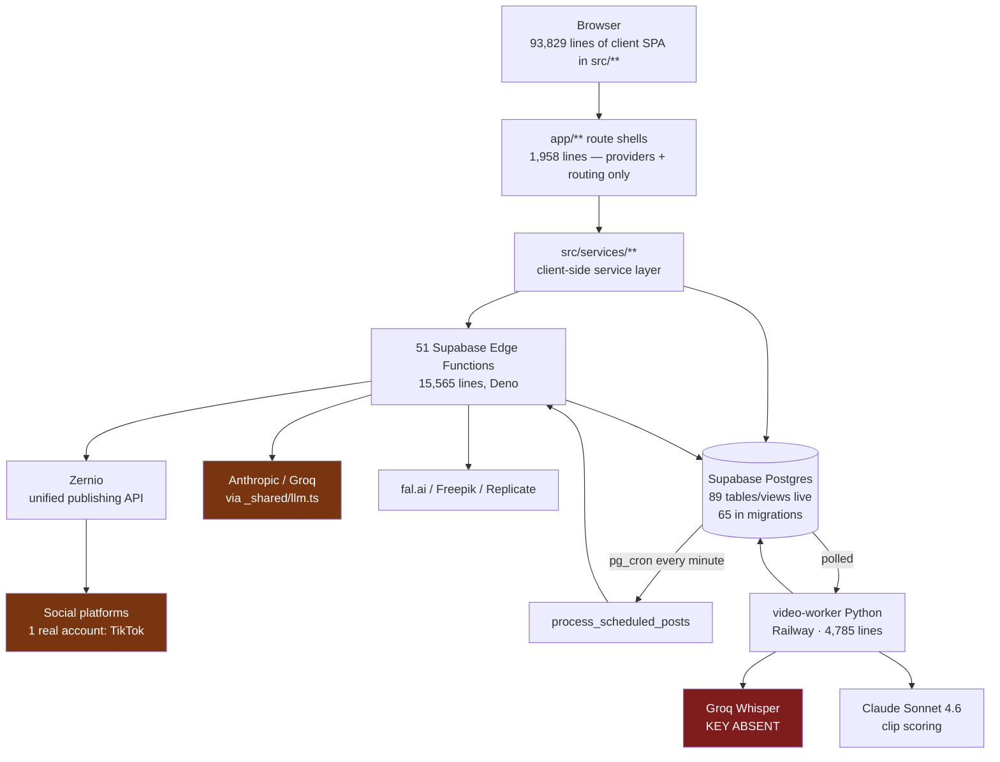

# D1 — Ground Truth Report
**Deep Launch-Readiness Audit · Brandosse** · Phase 1 · 2026-08-21

> 117 findings across 11 pillars, in `audit/findings/*.yaml`.
> Every claim carries a `file:line` citation or live-DB evidence. Nothing is rated COMPLETE — per the charter, that rating cannot be assigned before D4 exists.

---

## 1. Maturity Table

| Pillar | Maturity | Status | One-line justification |
|---|---|---|---|
| **P1** Ideation | **L1** | Scaffolded | No real-world signal enters ideation; brand-kit conversation is stubbed; no idea capture |
| **P2** Planning | **L1–L2** | Scaffolded → happy path | Single-post scheduling works well; every *planning* mechanism is dead code, seed data, or a silent no-op |
| **P3** Text generation | **L2–L3** | Happy path → functional | Genuinely produces on-brand copy; no iteration, no versioning, stale default model |
| **P4** Video generation | **L1** | Scaffolded | Never produced a video in the product's history. 1 real asset in 32 attempts |
| **P4i** Image generation | **L3–L4** | Functional → competitive | **Strongest pillar in the audit.** Credit integrity correct; margins positive; brand kit reaches the prompt |
| **P5** Video clipping | **L2** | Happy path | Has produced 43 real clips; 10 of 15 jobs failed; transcription key absent |
| **P6** Publishing | **L2** | Happy path | Real publishing works — on one platform, one account, 6 posts. 4 accounts silently unpublishable |
| **P7** SEO / reach | **L2** | Happy path | Well-engineered LLM scorer with zero external signal and no feedback loop |
| **P8** Analytics | **L1** | Scaffolded + fabricating | Zero real engagement data anywhere; the one job that runs writes fabricated trends |
| **P9** Dashboard shell | **L2** | Happy path | 71% migrated to ui-v2; unstyled nav on 4 routes incl. billing; UI misreports system state |
| **P10** Foundations — security | **L1** | **Not safe to ship** | Cross-user data read confirmed live with an ordinary user JWT |
| **P10** Foundations — cost | **L2** | Happy path | Clipping margin ~96%; video generation loses money at the cheapest tier |
| **P10** Foundations — quality | **PARTIAL** | — | Agent killed twice. **Coverage gap — see §5** |

**Launch floor check:** the charter requires no user-facing pillar below L3, and at least one at L5.
**Result: zero pillars are at or above L3. Zero are at L5. Every user-facing pillar is below the floor.**

**L5 candidate assessment.** The founder's answer at Gate 0 was "all pillars, non-negotiable." No pillar is a current L5 candidate. The *structurally strongest* candidate is not the one with the most code — it is **P5 clipping**, because its rubric-based moment scoring (`video-worker/stages/analyze.py:29-45`) is real engineering, its transcription is best-in-class and effectively free ($0.04/hour), and its margin is ~96%. Its blockers are two unset environment variables. That is an extraordinary value-to-unblock ratio and it is addressed in D6.

---

## 2. Architecture

**The defining structural fact:** `app/**` is a thin routing shell. Substantially all logic runs client-side in `src/**`. Server components and server-side data fetching are effectively unused (ARCH-004).

---

## 3. End-to-End Traces

One complete trace per pillar, with the exact break point.

| ID | Path | Breaks at |
|---|---|---|
| **T-P2-04** | ⌘K bar → `calendarAIService.js:212` → `calendar-ai` edge fn → generates a real weekly plan → "Apply week plan" button → `CalendarPage.jsx:568-606` | **Falls through unhandled.** Dialog closes, nothing written, no toast, no error |
| **T-P3-01** | `StudioPage.jsx:637` → `SessionStore.js:1683` → `generationPipeline.js:123` → `briefBuilder` + `brandKitLoader` → `generate-content-plan` → `_shared/llm.ts:149` → provider → `contentPlanValidator` → `qualityGate` → `content_plans` insert → `PostProductionPanel.jsx:199` | Completes. Degrades at provider routing (P3-001), validator (P3-007); **no revision is ever written** (P3-003) |
| **T-P4-01** | Studio → `generateVideo` → fal.ai | **0 of 2 lifetime attempts succeeded.** 18 of 32 "generations" point at a Google demo MP4 |
| **T-P5-07** | URL submit → `video_jobs` row → worker poll → `download.py` (yt-dlp) | **Bot detection: "Sign in to confirm you're not a bot."** 10 of 15 jobs. Mitigation exists in config and is unset |
| **T-P6-01** | Compose → schedule → pg_cron (healthy, every minute) → `dispatch_scheduled_post` → `publish-post:142` → `is_mock` branch → `publishToZernio` → TikTok | Works for 1 real account. **4 accounts marked real hit `publish-post:164` "Unsupported provider"** |
| **T-P6-03** | `publish-post:126` sets `status='publishing'` → provider call → terminal update | **If anything interrupts, the post is frozen forever.** 20 live posts stuck, oldest 2026-04-04 |
| **T-P7-01** | Post → `_shared/seo.ts:233 scoreContent` → Claude → 9 sub-scores → weighted sum → badge | Completes. **Every input originates from the post itself** — no external signal, weights never learn |
| **T-P8-01** | 0 real engagement rows → `daily-analysis` (runs daily, 02:00 UTC) → writes 2 fabricated trend strings → **nothing reads that table** | Broken at both ends: no real source, no consumer |
| **T-P9-04** | Dashboard mount → `useDashboardData.js:226` → `connected_accounts_health_summary` → `toAccountCard():117` derives badge from `connection_status` only | **`health_score=20/100` with a recorded failure reason renders as green "Healthy"** |
| **T-P10s-01** | anon-key password login → user JWT → `GET /rest/v1/posts` | **Returns 30 rows belonging to 7 other users, full captions.** Verified first-hand |

---

## 4. The Dominant Pattern

Across every pillar, the recurring defect is **disconnection, not absence.** Substantial, well-engineered code exists and is not wired to the running product:

| Built | Lines | State |
|---|---|---|
| `video-worker/utils/clip_selector.py` | 292 | Imported by nothing |
| `video-worker/utils/llm_client.py` | 242 | Imported by nothing |
| `src/services/OptimalTimesService.js` | 466 | Imported nowhere; `optimal_posting_times` = 0 rows |
| `supabase/functions/generate-caption/` | — | Best caption prompt in the codebase; called by no UI |
| Ghost-slot logic (`daily-analysis:230-324`) | — | Gated behind a flag false for all 7 users, no UI to change it |
| `week_plan` calendar action | — | Generated correctly, handler missing (`CalendarPage.jsx:605`) |
| `src/app/**` + `src/api/**` | 17 files | Complete dead duplicate incl. Stripe webhook |
| `youtube_cookies` config | — | Designed to fix the exact failure that kills 2/3 of clip jobs; unset |
| `WORKER_GROQ_API_KEY` | — | Required by stage 2 of the pipeline; absent |

**This is the audit's most important structural conclusion, and it is good news.** A large share of the roadmap is reconnection and configuration rather than construction — dramatically cheaper than the surface picture suggests. It also explains why the repo's own documentation overstates readiness: the code genuinely exists.

**The counterweight:** this pattern is *why* nothing was noticed. Which leads to §5.

---

## 5. Why Nothing Was Caught — and Audit Coverage Gaps

### 5.1 The system cannot detect its own failures

- `get_cron_job_status()` filters `cron.job` through a **hardcoded three-name allowlist** (`20260710110000_cron_reliability_and_credit_reset.sql:55`), and `healthCheck` calls it. A fabricated-data job ran daily for **five months** invisibly.
- Groq failed 100% for days; the Claude fallback worked, so nothing alerted (P3-001).
- 20 posts frozen since April, 4 clips stuck since June, `background_jobs.queued` unreapable by construction — **none detected by any monitoring.**
- CI builds only. One Playwright spec against ~109,000 lines.

Every large finding in this audit was invisible to the operator until someone read the code or queried the database directly.

### 5.2 Coverage gaps in this audit — stated plainly

Three agent slots were killed repeatedly by API and session limits and could not be completed:

| Gap | Impact | What is needed |
|---|---|---|
| ~~P4i — image generation~~ | **CLOSED 2026-08-21.** Audited directly by the orchestrator after the agent was killed four times. 5 findings in `A7-P4i.yaml`. **Users are NOT charged for failed generations** | — |
| **P10 quality/observability** | Only 3 of ~9 planned findings banked. Swallowed-error inventory, timeout/retry table, and the actual test-suite result are missing | One agent run; the guard scripts must actually be executed |
| **Persona walkthroughs (A15/A16)** | Never ran. All UX findings are code-derived or single-agent observations rather than a full unaided first-run walkthrough | Live Playwright session as each persona |

These gaps are recorded rather than papered over. **P4i has since been closed** (2026-08-21) and resolved in the product's favour — credit integrity on the image path is correct. The remaining gaps are the persona walkthroughs and part of the quality inventory.

---

## 6. Severity Distribution

*(Counts computed directly from `audit/findings/*.yaml`, 117 findings total.)*

| Severity | Count |
|---|---|
| MAJOR | 62 |
| **BLOCKER** | **29** |
| MINOR | 20 |
| CRITICAL | 2 |
| HIGH | 2 |
| MEDIUM | 2 |

*(CRITICAL and HIGH come from the security agent, which used its own scale; they map onto BLOCKER/MAJOR in D3.)*

| Status | Count | Meaning for the roadmap |
|---|---|---|
| `BUILT-BUT-INADEQUATE` | 77 | **Exists — needs finishing** |
| `STUBBED` | 28 | **Exists as a shell — needs connecting** |
| `MISSING` | 12 | **Needs building** |

> **105 findings describe things that already exist. 12 describe things that must be built — a ratio of roughly 9:1.**
> This is the single most important number for planning expectations: the overwhelming majority of remaining work is completing and connecting what is already in the repository, not creating new capability. It is also why the codebase *feels* further along than it measures — because in an important sense it is.

**Findings per pillar:** P4 (20), P5 (11), P9 (11), P2 (10), P3 (10), P1 (9), P8 (8), P10-security (8), P10-quality (6), P6 (6), P7 (5), P4i (5), P10-cost (4), cartography (4).

---

## 7. Gate 1 Position

All ten pillars have coverage; two have partial coverage as declared in §5.2. The findings support proceeding to gap synthesis (D3) and the completion definitions (D4).

**Two items should not wait for the audit to finish**, and are stated here because they are live:
1. **Cross-user data exposure** (P10s-001/002) — verified reproducible with an ordinary account.
2. **The live webhook secret committed to the repo** (P10s-005) — verified to match the current value in both `.env.local` and `video-worker/.env`.
