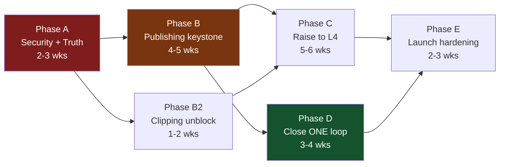

# D6 — Completion Roadmap
**Deep Launch-Readiness Audit · Brandosse** · Phase 6 · 2026-08-21

> **Completion Lock enforced.** Every item below completes or connects something that already exists in the repository. Zero new features. Genuinely new ideas are parked in D8.
> Effort in **weeks of solo-founder work with AI assistance** (Gate 0: no fixed date, quality gates the launch).
> Acceptance criteria trace to D4 (`DoC-n`).

---

## Critical Path

**The critical path runs A → B → D → E.** Publishing (B) is the keystone: analytics cannot exist without published posts, the loop cannot close without analytics, and reach cannot be grounded without the loop. **Everything downstream of the thesis depends on P6.**

**Proof of that dependency, not assertion:** `external_post_id` is written at `publish-post/index.ts:212` and read by nothing. It is the attribution key. Until posts actually publish across platforms, no metric can be fetched, so `platform_analytics` stays at 0 rows (verified), so `optimal_posting_times` never populates (its ≥5-published-posts-per-platform gate never opens — verified), so the discovery score can never learn (weights are constants, P7-002). One unmet precondition cascades through four pillars.

**Phase B2 runs in parallel** with B — it shares no files and no dependencies, and it is the cheapest high-value work in the audit.

---

## Phase A — Security & Truth *(2–3 weeks)*

**Nothing ships before this. Two items are live right now.**

| ID | Item | Scope | Effort | Acceptance |
|---|---|---|---|---|
| **A1** | Close cross-user RLS gap | Run `SELECT * FROM pg_policies WHERE tablename IN ('posts','generations')`; repair policies; **write the cross-tenant test** (log in as A, attempt B's rows across all 89 tables) | M | DoC-10: zero cross-tenant reads, automated |
| **A2** | Rotate committed secret | Rotate `WORKER_WEBHOOK_SECRET`; purge from history; add secret scanning to CI | S | DoC-10: zero live secrets in git |
| **A3** | Fix admin privilege path | `admin-list-posts:167-205` → use shared `_shared/org.ts:isSuperAdminUser`; restrict `profiles.role` from self-update | S | DoC-10 |
| **A4** | Zernio OAuth CSRF | `app/api/auth/zernio/callback/route.js` — add state param + session check | S | DoC-10 |
| **A5** | Un-blind job monitoring | Delete the allowlist at `20260710110000_...sql:55`; alert on unknown/failing jobs | XS | DoC-10: no allowlists |
| **A6** | **Stop fabricating trend data** | Disable the `mockTrends` writer in `daily-analysis:337-372` | XS | DoC-5: zero fabricated data as signal |
| **A7** | Mock defaults to off | `video-worker/config.py:21-22` → `default=False`; extend startup validation to keys for enabled stages | XS | DoC-8, DoC-10 |
| **A8** | Delete dead duplicate tree | Remove `src/app/**`, `src/api/**` (17 files incl. a dead Stripe webhook) | XS | ARCH-001 |

**Exit gate:** cross-tenant test passes; no live secret in history; all scheduled jobs visible to monitoring; no fabricated data written anywhere.

> **A5, A6, A7, A8 are all XS and together remove four entire classes of silent failure.** Do them first — they cost about a day and make every later phase observable.

---

## Phase B — Publishing, the keystone *(4–5 weeks)*

| ID | Item | Scope | Effort | Acceptance |
|---|---|---|---|---|
| **B1** | Reaper for stuck states | pg_cron job: `publishing` >15 min → `failed` + reason; backfill the 20 existing rows; same for `background_jobs.queued` (unreapable by construction, `process-jobs:53-54`) and `video_clips.pending` | S | DoC-1: zero non-terminal >1hr |
| **B2** | Truthful account state | Migrate `provider='direct'` accounts to `needs_reconnect`; UI reconnect CTA; badge derives from capability + `health_score`, not `connection_status` alone (`toAccountCard():117-140`) | M | DoC-1, DoC-9 |
| **B3** | **Expand real publishing to ≥4 platforms** | Complete Zernio integration per platform; per-platform media/caption constraint enforcement via `platformCaptionSpecs.ts` | **L** | DoC-1: ≥4 platforms, ≥98% success |
| **B4** | Publish-failure notifications | Write `user_notifications` on final failure; surface in UI | M | DoC-1 |
| **B5** | Verify Zernio dependency | Confirm SLA, rate limits, token-refresh behaviour, pricing | S | Risk #3 |

**Exit gate:** 4 platforms publish for real; no post can vanish; every failure notifies; no account misreports its state.

---

## Phase B2 — Clipping unblock *(1–2 weeks, parallel)*

> **The highest value-to-effort ratio in the audit.** Genuinely competitive machinery gated behind configuration.

| ID | Item | Scope | Effort | Acceptance |
|---|---|---|---|---|
| **B2-1** | Set `WORKER_GROQ_API_KEY` | Absent from `video-worker/.env`; pipeline cannot pass stage 2 | **XS** | DoC-2 |
| **B2-2** | Fix YouTube ingestion | Set `WORKER_YOUTUBE_COOKIES` (mitigation already designed, `config.py:24-26`); then durable cookie rotation / residential proxy | **S → L** | DoC-2: ≥90% ingestion success |
| **B2-3** | Fix analysis truncation | `analyze.py` `max_tokens=4096` truncates long videos; segment the analysis | M | DoC-2: no moment lost |
| **B2-4** | Platform export presets | 9:16 / 1:1 / 16:9 with safe zones | M | DoC-2 |
| **B2-5** | Honest failure surfacing | Raw tracebacks currently render verbatim (`JobStatusPipeline.jsx:215`) under a hardcoded "Credits have been refunded" wired to no refund state | S | DoC-2: no raw tracebacks |
| **B2-6** | Delete dead clipping code | `clip_selector.py` (292), `llm_client.py` (242), `transcript_parser.py`, `video_reframer.py` | XS | ARCH-003 |

**Exit gate:** paste a YouTube URL → usable captioned vertical clips, ≥90% of the time, on 20 varied real videos.

---

## Phase C — Raise BUILT-BUT-INADEQUATE to L4 *(5–6 weeks)*

| ID | Item | Scope | Effort | Acceptance |
|---|---|---|---|---|
| **C1** | Text versioning & refinement | Use `content_versions`; instruction-based refinement instead of blind overwrite (`PostProductionPanel.jsx:786-806`) | M | DoC-3: ≥3 revisions, revert |
| **C2** | Fix model selection | Set `ANTHROPIC_MODEL` explicitly; per-task policy; re-tune prompts; **alert on provider fallback** | S | DoC-3 |
| **C3** | Reconnect `generate-caption` | Best caption prompt in the codebase, called by no UI | S | DoC-3 |
| **C4** | Remove no-op AI actions | `CalendarPage.jsx:568-606` — implement `week_plan`, `suggest_slots`, `add_draft_post`, `delete_post`, or stop offering them | M | DoC-4: zero silent no-ops |
| **C5** | Bulk calendar operations | Multi-select, bulk reschedule, bulk delete | M | DoC-4 |
| **C6** | Finish ui-v2 migration | 5 remaining routes; **fixes the unstyled billing page** (`P9-008`); delete legacy shell + stylesheets; rebuild GoldenReference on ui-v2 | L | DoC-9: 100% on ui-v2 |
| **C7** | Shared nav component | 9 pages hand-copy `NAV_ITEMS`; 5 of 9 omit Analytics; video generation has no nav entry at all | S | DoC-9 |
| **C8** | Fix dead search box | Rendered on 4 routes, wired to no-op props | S | DoC-9 |
| **C9** | Reprice video generation | **Before any P4 repair** (P10o-002); decouple from the minute-based credit unit; remove the silent 3× tier upgrade (`generateVideo:102-104`); reconcile the internal cost table against live rates | M | DoC-8: positive margin at every tier |
| **C10** | Relabel discovery score | Present as a stylistic checklist, not a reach predictor, until grounded; ≤3 actionable suggestions for casual users | S | DoC-7 |
| **C11** | Brand-kit conversation | Currently stubbed; upstream of every ideation prompt | M | DoC-5 |

---

## Phase D — Close ONE loop handoff *(3–4 weeks)*

> **This is where differentiation is won.** Not by breadth — by making one handoff INTACT and provable.

| ID | Item | Scope | Effort | Acceptance |
|---|---|---|---|---|
| **D1** | Ingest real platform metrics | Fetch performance per `external_post_id` on a schedule; write `platform_analytics` | L | DoC-6: ≥95% attribution intact |
| **D2** | **Close P8→P3** | Include the user's top-performing prior posts as prompt context in generation | M | DoC-6: **one handoff INTACT with a citable carrier** |
| **D3** | Reconnect `OptimalTimesService` | 466 lines, imported nowhere; drive it from real performance; wire into scheduling | M | DoC-6: P8→P2 carrier |
| **D4** | Analytics table stakes | Export, date-range comparison, per-platform, per-post drill-down | M | DoC-6 |
| **D5** | Loop-closure dashboard | Count of generations informed by prior performance | S | DoC-6 |

**Exit gate:** a user's generated content demonstrably reflects what actually performed for them — and you can point at the line of code that carries it.

---

## Phase E — Launch hardening *(2–3 weeks)*

| ID | Item | Scope | Effort | Acceptance |
|---|---|---|---|---|
| **E1** | Error tracking + alerting | Sentry or equivalent; alert on fallback, failure-rate, stuck-state | M | DoC-10 |
| **E2** | Timeouts on every outbound call | Audit all provider calls | S | DoC-10 |
| **E3** | CI runs tests | Currently build-only; wire the guard scripts in; make the cross-tenant test blocking | S | DoC-10 |
| **E4** | Onboarding to first value ≤5 min | Measure and fix the real path | M | DoC-9 |
| **E5** | Cost-per-user tracking | Per-user cost with deviation alerts and a video ceiling | M | DoC-10 |
| **E6** | Empty states everywhere | Guidance + next action on every zero-data surface | S | DoC-9 |
| **E7** | **Audit the coverage gaps** | P4i image generation (credit integrity — touches money), P10 quality inventory, persona walkthroughs | M | D5 §7 |

---

## Parallelization Map

| Can run concurrently | Must be sequential |
|---|---|
| Phase A items A5–A8 (all XS, independent) | A1 before anything ships |
| Phase B2 alongside all of Phase B | B3 before D1 (no posts → no metrics) |
| C6/C7/C8 (frontend) alongside C1/C2/C3 (backend) | D1 before D2/D3 |
| C9 repricing alongside anything | **C9 before any P4 repair** |
| E1/E2/E3 alongside Phase D | E7 before final go/no-go |

---

## Definition of Done per phase

- **A:** cross-tenant test green; no live secrets; all jobs monitored; nothing fabricated.
- **B:** 4 platforms real; zero vanishing posts; failures notify; accounts truthful.
- **B2:** ≥90% ingestion success on 20 varied real videos.
- **C:** every D4 L4 bar met for in-scope pillars; zero silent no-ops; 100% ui-v2.
- **D:** ≥1 loop handoff INTACT with a cited carrier.
- **E:** the operator learns about failures before users do.

---

## What is deliberately NOT in this roadmap

Per the Completion Lock, and to be explicit about scope discipline:

- **P4 video generation repair** — beyond repricing (C9). It has never worked, has negative margin at the cheapest tier, and repairing it worsens unit economics (P10o-002). D5 recommends cutting it from v1. If the founder overrides that, it becomes a Phase F of ~4–6 weeks and **must follow C9**.
- **Grounding the discovery score in external data** (P7 to L4/L5) — requires a new data source, so C10 relabels it honestly instead. Parked in D8.
- Everything in D8.
